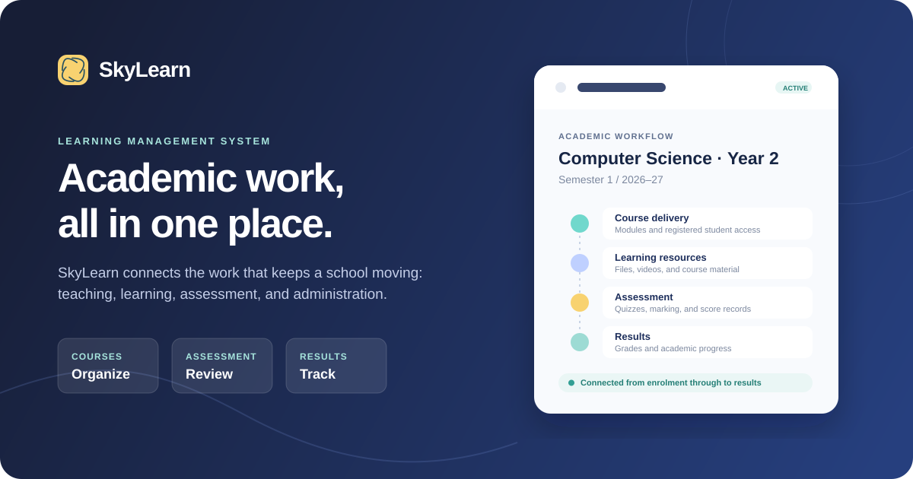

# SkyLearn LMS

SkyLearn LMS is a Django-based learning management system for schools, colleges, and training institutes. It helps manage users, courses, enrollments, quizzes, student results, uploaded learning materials, and basic payment screens from one web application.



## Features

- Admin, lecturer, student, and parent user roles
- Student, lecturer, department, program, session, and semester management
- Course creation, course allocation, course registration, and add/drop workflows
- Course packages, uploaded course files, and uploaded course videos
- Attendance, assignment, midterm, final exam, total score, grade, and result management
- Student assessment results and grade result pages
- Quiz management with multiple-choice, true/false, essay marking, pass marks, and progress tracking
- PDF generation for student records and result-related pages
- Search, news/events, email configuration, and session timeout support
- Payment gateway pages for Stripe, PayPal, Coinbase, Paylike, and GoPay
- SQLite for local development and PostgreSQL support for Docker/production

## Core Functionality

SkyLearn is organized around the day-to-day flow of an academic institution. Administrators set up the academic structure, lecturers manage learning and assessment, students access their courses and results, and parents can be linked to student records.

### User and Role Management

The system includes separate account flows for admins, lecturers, students, and parents. Admin users can create and manage student and lecturer profiles, assign basic academic information, and control access to pages based on user role. The project also includes profile pages, password management, login/logout flows, and session timeout handling.

### Academic Setup

Admins can configure the academic structure used throughout the LMS. This includes departments, programs, sessions/years, semesters, and course records. Courses can be grouped by program and semester so that students and lecturers interact with the correct academic data.

### Course Management

Courses can be created, updated, allocated to lecturers, and made available to students for enrollment. Students can register for available courses and use add/drop workflows where enabled. Course pages can include uploaded files and videos, making each course a place to manage both academic records and learning materials.

### Assessment and Results

Lecturers can submit student scores for attendance, assignments, mid exams, and final exams. The system calculates totals, averages, grade points, grades, and result comments automatically. Students can view their assessment results and grade results, while admins can manage result records across semesters.

### Quiz System

The quiz module supports multiple-choice, true/false, and essay-style questions. Quizzes can define pass marks, attempt limits, randomized question order, category-based progress tracking, explanations, and custom pass/fail messages. Completed quizzes can be reviewed, filtered, and marked where essay questions require manual grading.

### Files, PDFs, and Search

The LMS supports course document uploads, course video uploads, student record pages, and PDF generation for printable academic documents. Search functionality helps users find records and content across the system.

### Payments

The project includes payment-related pages and templates for gateways such as Stripe, PayPal, Coinbase, Paylike, and GoPay. Payment keys and production behavior should be configured through environment variables before using payment features in a real deployment.

## Tech Stack

- Python 3.8+
- Django 4.0.8
- SQLite or PostgreSQL
- Bootstrap 5
- django-crispy-forms
- django-filter
- django-modeltranslation
- django-extensions
- Whitenoise
- ReportLab and xhtml2pdf

## Project Structure

```text
accounts/      User accounts, roles, profiles, and authentication helpers
core/          Dashboard, sessions, semesters, news, and shared academic data
course/        Programs, courses, allocation, enrollment, packages, and uploads
quiz/          Quizzes, questions, sittings, progress, results, and marking
result/        Scores, grades, GPA, and result pages
payment/       Payment models, routes, and gateway templates
search/        Search views and template tags
templates/     Django HTML templates
static/        CSS, JavaScript, images, and frontend assets
requirements/  Python dependency files
```

## Local Setup

### 1. Clone the repository

```bash
git clone https://github.com/UdaiBatta/LMS.git
cd LMS
```

### 2. Create and activate a virtual environment

Windows PowerShell:

```powershell
python -m venv venv
.\venv\Scripts\Activate.ps1
```

macOS/Linux:

```bash
python3 -m venv venv
source venv/bin/activate
```

### 3. Install dependencies

```bash
pip install -r requirements.txt
```

### 4. Create the environment file

Copy the example environment file:

Windows PowerShell:

```powershell
Copy-Item .env.example .env
```

macOS/Linux:

```bash
cp .env.example .env
```

Update `.env` with your local values:

```env
SECRET_KEY=replace-with-a-long-random-secret
DEBUG=True
ALLOWED_HOSTS=localhost,127.0.0.1
CSRF_TRUSTED_ORIGINS=
EMAIL_BACKEND=django.core.mail.backends.console.EmailBackend
SESSION_COOKIE_AGE=600
```

For local development, leave `DATABASE_URL` empty or unset to use SQLite.

### 5. Run database migrations

```bash
python manage.py migrate
```

### 6. Create an admin user

```bash
python manage.py createsuperuser
```

### 7. Start the development server

```bash
python manage.py runserver
```

Open the app:

```text
http://127.0.0.1:8000
```

Open the admin panel:

```text
http://127.0.0.1:8000/admin/
```

## Docker Setup

Docker Compose starts the Django app with PostgreSQL.

### 1. Create `.env`

```bash
cp .env.example .env
```

On Windows PowerShell:

```powershell
Copy-Item .env.example .env
```

### 2. Build and run the containers

```bash
docker compose up --build
```

The app will run at:

```text
http://127.0.0.1:9000
```

### 3. Create a superuser inside the web container

```bash
docker compose exec web python manage.py createsuperuser
```

## Generate Demo Data

After running migrations, you can create sample data with:

```bash
python manage.py runscript generate_fake_accounts_data
python manage.py runscript generate_fake_core_data
python manage.py runscript generate_fake_data
```

## Useful Commands

Create migrations:

```bash
python manage.py makemigrations
```

Apply migrations:

```bash
python manage.py migrate
```

Run tests:

```bash
python manage.py test
```

Collect static files:

```bash
python manage.py collectstatic
```

Format code:

```bash
black .
```

## License

This project is licensed under the terms of the [LICENSE](LICENSE) file.
